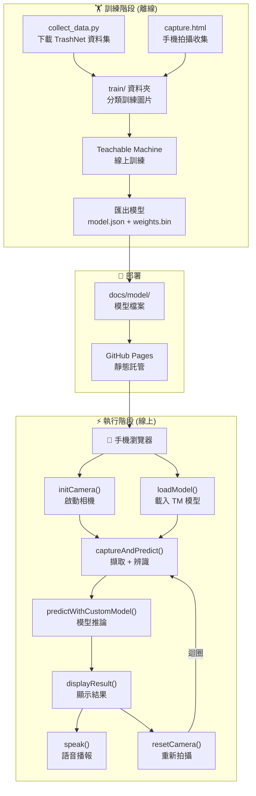
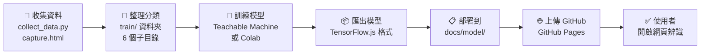

# SmartRecycle AI - 開發文件

## 📋 目錄

- [環境需求](#環境需求)
- [專案結構](#專案結構)
- [模型訓練](#模型訓練)
- [前端開發](#前端開發)
- [部署指南](#部署指南)
- [API 預留](#api-預留)

---

## 環境需求

### colab 訓練環境
[my colab](https://colab.research.google.com/drive/1gti8Y3f7MtA33J7oZJjRGXZR-tdpJkJX#scrollTo=X8HDRGkfXFNX)

### Python 訓練環境

```bash
Python 3.10+
TensorFlow 2.15+
tensorflowjs
Pillow
requests
```

### 安裝依賴

```bash
pip install tensorflow tensorflowjs Pillow requests
```

---

## 專案結構

```
04/
├── docs/                      # Web 應用 (部署到 GitHub Pages)
│   ├── index.html             # 主頁面結構
│   ├── styles.css             # 全域樣式 (響應式、深色模式)
│   ├── app.js                 # 主要邏輯 (相機、辨識、UI)
│   ├── config.js              # 設定檔 (類別、閾值)
│   ├── capture.html           # 訓練資料收集工具
│   └── model/                 # TensorFlow.js 模型檔案
│       ├── model.json         # 模型架構
│       ├── group1-shard*.bin  # 權重檔案
│       └── labels.json        # 類別標籤
│
├── train/                     # 訓練資料 (gitignored)
│   ├── garbage/               # 278 張
│   ├── metal_can/             # 80 張
│   ├── paper/                 # 160 張
│   ├── paper_container/       # 27 張
│   └── plastic/               # 80 張
│
├── train_model.py             # MobileNetV2 Transfer Learning
├── collect_data.py            # TrashNet 資料集下載
├── convert_tfjs.py            # 模型轉換腳本
├── README.md                  # 專案說明
├── DEVELOP.md                 # 開發文件 (本檔案)
└── .gitignore
```

---

## 系統架構圖

### 整體架構



### 前端檔案關係

```mermaid
flowchart LR
    subgraph HTML["index.html"]
        direction TB
        H1["載入 TensorFlow.js"]
        H2["載入 Teachable Machine 庫"]
        H3["載入 marked.js"]
        H4["載入 config.js"]
        H5["載入 app.js"]
    end

    subgraph Config["config.js"]
        direction TB
        C1["MODEL 設定"]
        C2["RECOGNITION 閾值"]
        C3["CATEGORIES 類別"]
        C4["API 端點"]
    end

    subgraph App["app.js"]
        direction TB
        A1["相機控制"]
        A2["模型載入/預測"]
        A3["結果顯示"]
        A4["語音播報"]
        A5["AI Chat"]
    end

    subgraph Model["model/"]
        direction TB
        M1["model.json"]
        M2["weights.bin"]
        M3["metadata.json"]
    end

    HTML --> Config
    HTML --> App
    Config -->|讀取設定| App
    App -->|載入| Model
```



### 模型訓練流水線



---

## 模型訓練

### 使用 Teachable Machine（推薦）

由於 TensorFlow 版本相容性問題（Keras 3 vs TFJS），建議使用 [Teachable Machine](https://teachablemachine.withgoogle.com/) 訓練模型。

#### 1. 準備訓練資料

將訓練照片整理到 `train/` 資料夾：

```
train/
├── aseptic carton/    # 鋁箔包
├── garbage/           # 一般垃圾
├── metal_can/         # 鐵鋁罐
├── paper/             # 紙類
├── paper_container/   # 紙餐盒
└── plastic/           # 塑膠類
```

> **注意**: 類別名稱會成為模型輸出的 label，必須與 `config.js` 中的 `CATEGORIES[].id` 一致。

#### 2. 在 Teachable Machine 訓練

1. 開啟 https://teachablemachine.withgoogle.com/
2. 選擇 **Image Project** → **Standard image model**
3. 為每個類別新增 Class，名稱要與資料夾名稱相同
4. 上傳對應資料夾的照片
5. 點擊 **Train Model** 開始訓練
6. 訓練完成後，點擊 **Export Model**
7. 選擇 **Tensorflow.js** → **Download**

#### 3. 部署模型到網站

1. 解壓縮下載的檔案，會得到：
   - `model.json` - 模型架構
   - `weights.bin` - 模型權重
   - `metadata.json` - 類別標籤

2. 複製這 3 個檔案到 `docs/model/` 資料夾：
   ```bash
   copy result\模型資料夾\*.* docs\model\
   ```

#### 4. 更新類別設定

如果類別有變動，需要同步更新 `docs/config.js` 中的 `CATEGORIES`：

```javascript
// 順序必須與 metadata.json 中的 labels 順序一致
CATEGORIES: [
    { id: 'aseptic carton', name: '鋁箔包', icon: '🧃', ... },
    { id: 'garbage', name: '垃圾', icon: '🗑️', ... },
    // ...
]
```

#### 5. 測試

```bash
cd docs
python -m http.server 8000
# 開啟 http://localhost:8000 測試
```

### Teachable Machine 範例程式碼

模型匯出時會提供 `example.js`，可參考其載入方式：

```javascript
// 使用 @teachablemachine/image 庫載入
const model = await tmImage.load(modelURL, metadataURL);
const predictions = await model.predict(imageElement);
```


---

## 前端開發

### 檔案說明

| 檔案 | 說明 |
|------|------|
| `index.html` | 頁面結構、載入 TensorFlow.js |
| `styles.css` | 響應式佈局、深色模式、動畫 |
| `app.js` | 相機控制、模型載入、辨識邏輯 |
| `config.js` | 類別定義、模型路徑、API 設定 |

### 核心流程

```
initCamera() → loadModel() → captureAndPredict() → displayResult()
```

### 設定選項

編輯 `config.js`：

```javascript
MODEL: {
    URL: './model/model.json',
    INPUT_SIZE: 224,
    IS_CUSTOM_MODEL: true  // 使用自訓練模型
},
RECOGNITION: {
    CONFIDENCE_THRESHOLD: 0.7  // 信心度閾值
}
```

---

## 部署指南

### GitHub Pages

1. 確保 `docs/` 資料夾包含所有前端檔案
2. 到 Repository Settings → Pages
3. Source 選擇 `main` branch, `/docs` folder
4. 儲存後等待部署完成

### 本地測試

```bash
cd docs
python -m http.server 8000
# 開啟 http://localhost:8000
```

---

## API 預留

### AI 解說功能 (Phase 3)

`config.js` 已預留 API 端點：

```javascript
API: {
    ENABLED: false,
    EXPLANATION_ENDPOINT: '/api/explain',
    TIMEOUT: 10000
}
```

### Vercel Serverless Function 範例

```javascript
// api/explain.js
export default async function handler(req, res) {
    const { category } = req.body;
    
    // 呼叫 Gemini/OpenAI API 取得解說
    const explanation = await getAIExplanation(category);
    
    res.json({ explanation });
}
```

---

## 常見問題

### Q: 模型載入失敗？

確認：
1. `model.json` 和 `.bin` 檔案都在 `docs/model/`
2. 使用 HTTP 伺服器（不能直接開啟 HTML 檔案）

### Q: 辨識不準確？

嘗試：
1. 確保物品在畫面中央
2. 保持穩定，避免模糊
3. 確保光線充足

### Q: 相機無法使用？

確認：
1. 使用 HTTPS 或 localhost
2. 已允許相機權限
3. 無其他應用佔用相機
