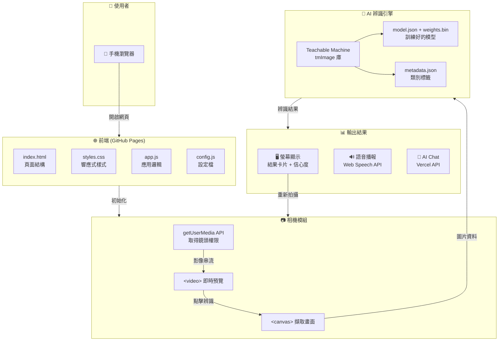
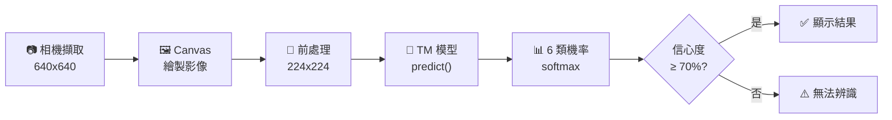

# 🗑️ SmartRecycle AI

一個手機友善的垃圾分類 Web 應用，使用 MobileNetV2 Transfer Learning 即時辨識回收物品。


## ✨ 功能特色

- 📷 **即時相機辨識** - 使用裝置相機即時辨識垃圾類別
- 🤖 **AI 分類** - 基於 MobileNetV2 的深度學習模型
- 📱 **手機優先** - 響應式設計，支援深色模式
- 🔊 **語音播報** - 可選的語音回饋功能
- 🖼️ **圖片上傳** - 也支援上傳圖片進行辨識

## 📊 支援類別

| 類別 | 說明 |
|------|------|
| 🗑️ 垃圾 | 一般垃圾，無法回收 |
| 🥫 鐵鋁罐 | 鐵罐、鋁罐、金屬容器 |
| 📄 紙類 | 紙張、報紙、書籍等 |
| 🥡 紙餐盒 | 紙製餐盒、紙杯等 |
| 🧴 塑膠類 | 塑膠瓶、塑膠容器等 |

## 🚀 快速開始

### 線上使用

開啟 [GitHub Pages 連結](https://penter405.github.io/recycle/) 即可使用（需允許相機權限）

### 問卷調查

[問卷連結](https://penter405.github.io/recycle/questionnaire.html)

### 本地執行

```bash
# 1. Clone 專案
git clone https://github.com/your-username/smartrecycle-ai.git
cd smartrecycle-ai

# 2. 啟動本地伺服器
cd docs
python -m http.server 8000

# 3. 開啟瀏覽器
# 電腦: http://localhost:8000
# 手機: http://<電腦IP>:8000
```

## 🛠️ 技術架構

- **前端**: HTML5 + CSS3 + Vanilla JS
- **AI 模型**: TensorFlow.js + MobileNetV2 Transfer Learning
- **訓練框架**: TensorFlow/Keras (Python)

### 系統架構圖



### 資料流程圖



## 📁 專案結構

```
├── docs/                  # Web 應用 (GitHub Pages)
│   ├── index.html         # 主頁面
│   ├── styles.css         # 樣式
│   ├── app.js             # 應用邏輯
│   ├── config.js          # 設定檔
│   └── model/             # TensorFlow.js 模型
├── train/                 # 訓練資料
├── train_model.py         # 訓練腳本
└── collect_data.py        # 資料收集腳本
```

## 📖 開發文件

詳細的開發說明與技術細節請參考 [DEVELOP.md](https://github.com/Penter405/recycle/blob/main/DEVELOP.md)
<!--
## 📈 模型效能

- **準確率**: ~93%
- **模型大小**: ~10MB
- **推論速度**: <500ms (視裝置而定)
-->

## 🙏 致謝

## [colab](https://colab.research.google.com/drive/1J_5QDh8ikT-NIAgqIDr9wtHJvxWTJd0S?usp=sharing)
- [TrashNet](https://github.com/garythung/trashnet) - 訓練資料來源
- [TeachableMachine](https://teachablemachine.withgoogle.com/) - 模型訓練工具
<!--- [TensorFlow.js](https://www.tensorflow.org/js) - 瀏覽器端機器學習(not using ,beacuse too tried)
- [MobileNetV2](https://arxiv.org/abs/1801.04381) - 基礎模型架構(not using ,beacuse too tried)
-->