# 系統流程圖與操作截圖對照

為了保證「**白色區塊完美呈現水平直線**」並且「**彩色區塊永遠緊緊相連在正下方**」，而且**支援無限多個節點橫向延伸**，我使用了一種更進階的排版方式——將主步驟和截圖區塊包裝在「同一個圖形節點」中！

你只要按照下方的語法，加上 `===> StepX` 即可無限往右新增步驟！

```mermaid
flowchart LR
    %% 節點 1
    Step1["<b>第一步：取得圖片</b><br/>• 開啟網頁初始化<br/>• 使用相機捕捉畫面<br/>
    <div style='background-color:#e8f5e9; padding:8px; margin-top:12px; border-radius:8px; border:2px dashed #4caf50; text-align:center;'>
        <b style='color:#2e7d32;'>🟢 待上傳：相機載入截圖</b><br/><br/>
        <img src='screenshots/image.png' width='100'/>
    </div>"]:::mainNode

    %% 節點 2
    Step2["<b>第二步：分析圖片</b><br/>• 擷取當前影像畫格<br/>• TM 模型執行推論<br/>
    <div style='background-color:#e0f7fa; padding:8px; margin-top:12px; border-radius:8px; border:2px dashed #00acc1; text-align:center;'>
        <b style='color:#00838f;'>🔵 待上傳：凍結畫面截圖</b><br/><br/>
        <img src='screenshots/image.png' width='100'/>
    </div>"]:::mainNode

    %% 節點 3
    Step3["<b>第三步：結果反饋</b><br/>• 得出最高機率類別<br/>• 顯示卡片與語音播報<br/>
    <div style='background-color:#e0f7fa; padding:8px; margin-top:12px; border-radius:8px; border:2px dashed #00acc1; text-align:center;'>
        <b style='color:#00838f;'>🔵 待上傳：辨識結果截圖</b><br/><br/>
        <img src='screenshots/image.png' width='100'/>
    </div>"]:::mainNode

    %% 節點 4
    Step4["<b>第四步：程式判定</b><br/>• 點擊重新拍攝繼續<br/>• 關閉網頁結束程式<br/>
    <div style='background-color:#e8f5e9; padding:8px; margin-top:12px; border-radius:8px; border:2px dashed #4caf50; text-align:center;'>
        <b style='color:#2e7d32;'>🟢 待上傳：重新拍攝截圖</b><br/><br/>
        <img src='screenshots/image.png' width='100'/>
    </div>"]:::mainNode

    %% 節點 5 (示範如何無限擴增)
    Step5["<b>第五步：更多擴展步驟</b><br/>• 可以隨時新增第 N 步<br/>• 會永遠對齊水平直線<br/>
    <div style='background-color:#fff3e0; padding:8px; margin-top:12px; border-radius:8px; border:2px dashed #fb8c00; text-align:center;'>
        <b style='color:#ef6c00;'>🟠 待上傳：自訂截圖</b><br/><br/>
        <img src='screenshots/image.png' width='100'/>
    </div>"]:::mainNode

    %% 利用粗黑色箭頭將所有節點完美串聯在一條水平線上
    Step1 ===> Step2 ===> Step3 ===> Step4 ===> Step5

    %% 統一代碼：白底黑框圓角
    classDef mainNode fill:#ffffff,stroke:#222,stroke-width:2px,rx:12px,ry:12px,color:#222,text-align:left;
    linkStyle default stroke:#000000,stroke-width:4px;
```

## 說明
1. 上半部固定為白色說明框，下半部固定為綠/藍的彩色截圖框（並且有虛線外框包覆圖片）。
2. 因為在代碼上這些都被視為「同一塊磚頭」，它們 **100% 保證上下對齊**，絕對不會排版跑掉！
3. Mermaid 使用 `LR`（Left to Right）模式，只要用 `===>` 將節點往下接，它會**無限相連保持完美的水平直線排版**！
