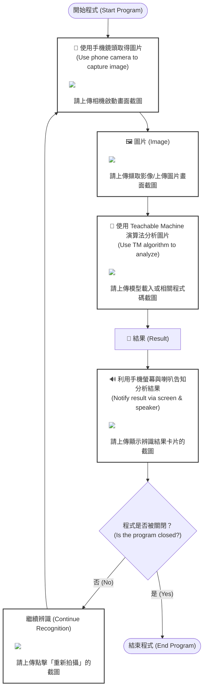

# 系統流程圖與操作截圖對照

下方為系統主要運作流程圖。請依照流程圖中標示為「**截圖待上傳**」的節點，提供對應的操作或程式碼截圖。

```mermaid
graph TD
    classDef screenshotNode fill:#fff,stroke:#333,stroke-width:2px;
    classDef defaultNode fill:#e1f5fe,stroke:#01579b,stroke-width:1px;

    Start(["開始程式 (Start Program)"]) --> Capture["📸 使用手機鏡頭取得圖片<br/>(Use phone camera to capture image)<br/><br/><img src='screenshots/image.png' width='80' /><br/>請上傳相機啟動畫面截圖"]
    
    Capture:::screenshotNode --> ImgResult["🖼️ 圖片 (Image)<br/><br/><img src='screenshots/image.png' width='80' /><br/>請上傳擷取影像/上傳圖片畫面截圖"]
    
    ImgResult:::screenshotNode --> Analyze["🤖 使用 Teachable Machine 演算法分析圖片<br/>(Use TM algorithm to analyze)<br/><br/><img src='screenshots/image.png' width='80' /><br/>請上傳模型載入或相關程式碼截圖"]
    
    Analyze:::screenshotNode --> FinalResult["📝 結果 (Result)"]
    
    FinalResult --> Notify["🔊 利用手機螢幕與喇叭告知分析結果<br/>(Notify result via screen & speaker)<br/><br/><img src='screenshots/image.png' width='80' /><br/>請上傳顯示辨識結果卡片的截圖"]
    
    Notify:::screenshotNode --> CheckClose{"程式是否被關閉？<br/>(Is the program closed?)"}
    
    CheckClose -- 否 (No) --> Continue["繼續辨識 (Continue Recognition)<br/><br/><img src='screenshots/image.png' width='80' /><br/>請上傳點擊「重新拍攝」的截圖"]
    
    Continue:::screenshotNode --> Capture
    
    CheckClose -- 是 (Yes) --> End(["結束程式 (End Program)"])
```

## 說明
- 流程圖中的圖示代表該步驟需要附加截圖。
- 請將準備好的截圖放入 `screenshots` 資料夾中，並在後續更新此檔案將 `screenshots/image.png` 替換為實際擷取的圖片檔名。
